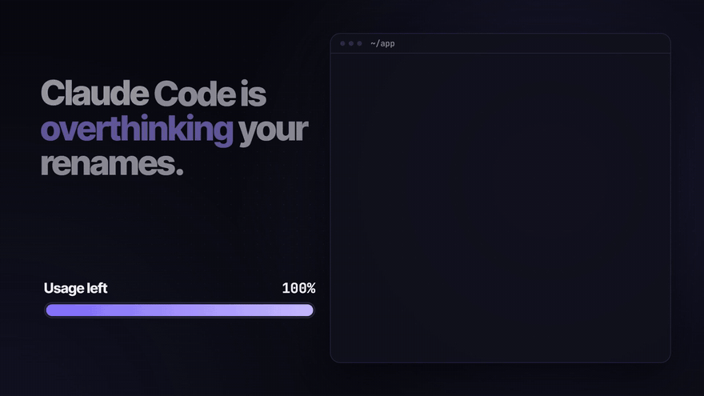
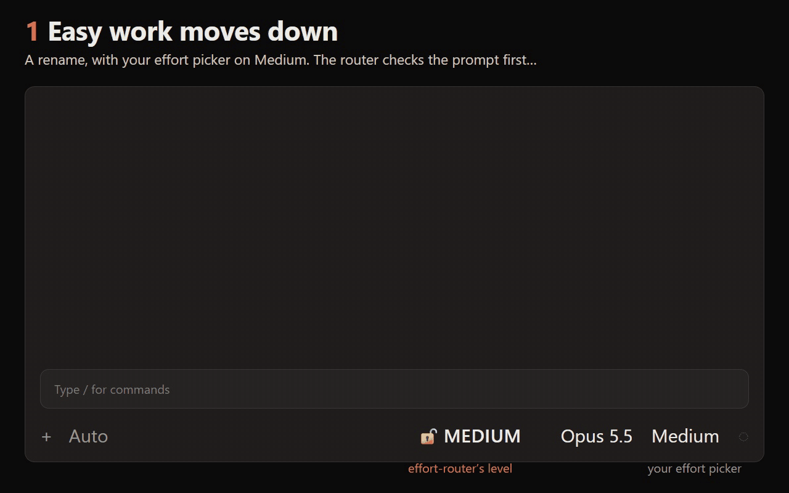

# effort-router

[](CHANGELOG.md)
[](https://code.claude.com/docs/en/plugins/mods/overview)
[](LICENSE)

**Make your Claude Code usage go up to twice as far.**

Claude Code is overthinking your renames. It runs every prompt at one effort level, so a one-line fix gets the same
deep thinking as a migration across three services. And every subagent it launches runs at that level too, so the
helper that only searches your files thinks as hard as you asked it to on the hardest problem.

effort-router picks the right effort for every prompt and every subagent. Easy work moves down, so your usage goes
further and answers come back up to 3.5x faster. Hard work moves up and gets done right first time, with no time or
usage lost to rework.

Free, 30 seconds to install, built on Anthropic's own advice in
[Spending your effort](https://claude.dev/blog/spending-your-effort/). By [Tommy Long](https://www.tommylong.com).



- **Subagents.** Without the router, Claude Code launches every subagent at your effort level unless you ask for another. With it, each
  subagent gets the level its own job needs, all session long: low for the file search, high for the tricky review.
- **Your session.** Your first five prompts are each checked and the level moves to the one that gets the work done
  fastest and cheapest, then it stays there. The footer shows the level in use. Click it to keep that level, switch
  the router off or ask it to look again.
- **Your rules.** Add to the routing rules in plain markdown, per user, per project or for a whole organisation.
- **Where it went.** `/er report` shows how much work ran at each level and what the router changed. (`/er` is
  short for `/effort-router`.)



It works with Fable 5.1, Opus 5.5, Sonnet 5.5 and Haiku 5.5, in the Desktop app's Code tab and in the terminal.

## Install

**In the Desktop app,** two steps:

1. **Add the marketplace.** Go to Customize, then Plugins, Add marketplace, Add from a repository, and enter
   `tommy5dollar/effort-router`.
2. **Install the plugin.** The app opens the new marketplace for you. Click **Add** on effort-router. If you've left
   that screen, it's under effort-router at the bottom of Plugins, Discover.

**In the terminal:**

```
claude plugin install effort-router --marketplace tommy5dollar/effort-router
```

Before Claude Code 2.1.292 that's two commands: `claude plugin marketplace add tommy5dollar/effort-router`, then
`claude plugin install effort-router@effort-router`.

If the terminal says some options aren't set yet, that's fine: they're optional and the defaults work.

Then start a new session. The Desktop app and the terminal share plugins, so either way installs it for both. In the
Desktop app the footer appears once you've sent the first message. `/er off` turns it off for a session, and
`claude plugin uninstall effort-router@effort-router` removes it.

## Does it save money and time?

That's what it's for. The higher you run, the more it saves. In our test, Fable 5.1 on xhigh was given three small
chores to hand to subagents. The router moved it to medium and its Opus subagents to medium or low. It finished in
about 2 minutes for $1.10 to $1.65, against 6 to 8.5 minutes and $3.20 to $3.75 left on xhigh, and every test passed
both ways. Those figures include the router's own assessments.

What a step down saves, roughly, in both cost and time:

| Step down | Opus 5.5 saves | Fable 5.1 saves |
| --- | ---: | ---: |
| xhigh → medium | 60% | 50% |
| high → medium | 25% | 25% |
| high → low | 50% | 40% |
| medium → low | 33% | 20% |

That's from our runs and Artificial Analysis's Intelligence Index (v4.3.2). The smaller the task, the less it saves,
because reading the conversation costs the same at every level. Over a long session it adds up, because high takes
more turns and reads more, and every later request pays to re-read all of it. In a 20-prompt session on Opus at high, the router finished 2:18 sooner and 63 cents cheaper.

On Opus 5.5's default of medium there's less to step down from, so it mostly picks off the small tasks. It still steps
up when the work clearly needs it, because a hard task done right first time costs less than the rework. Routing comes
out of your normal usage, with nothing extra to pay or sign up for: about 20 cents' worth a session on Opus 5.5 at API
prices. Each of the first five prompts waits a second or two for its assessment.

## What it reads, sends and stores

This plugin runs inside Claude Code without a sandbox, so here's exactly what it does:

- **Sends:** assessments go to your session's own model through Claude Code, on your existing login. If your
  organisation has set up Claude Code's OpenTelemetry, it adds a few attributes to Claude Code's own records for that
  collector (see [Telemetry](effort-router/#telemetry-for-organisations)). Nothing else leaves your machine.
- **Reads:** your conversation, your CLAUDE.md files, rules and memory, your agent definitions and its own rules files.
- **Writes:** one small JSON file per session in `~/.claude/effort-router/spend/`, and nothing else.
- **Never:** runs a process, changes your saved effort setting or changes the model.

[Full documentation](effort-router/) · [Common questions](effort-router/#common-questions) ·
[Changelog](CHANGELOG.md) · [Report a problem](https://github.com/tommy5dollar/effort-router/issues/new/choose)
