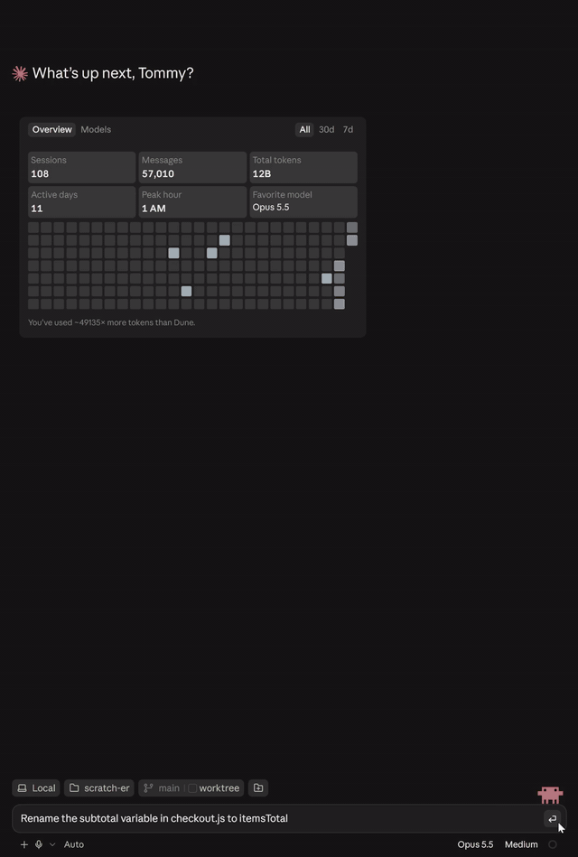

# claude-plugins

Claude Code plugins by [Tommy Long](https://www.tommylong.com).

## effort-router

[](CHANGELOG.md)
[](https://code.claude.com/docs/en/plugins/mods/overview)
[](LICENSE)

Claude Code runs every task at the effort level you picked, whether it's renaming a variable or a migration that
touches three services. Anthropic's [Spending your effort](https://claude.dev/blog/spending-your-effort/) says to
match the effort to the task. effort-router is a mod that does that for you.



- **Your session.** Your session's own model assesses each of your first five prompts and steps the level both ways:
  up for a prompt that needs more, back down for follow-ups that don't. It moves only when it's at least 70% sure the
  level running is wrong, then locks. The footer shows where it is, and clicking it gives you Lock, Unlock, Turn off
  and Assess.
- **Subagents.** Each subagent gets its own level, chosen by the agent launching it, which knows why it's delegating.
- **Your rules.** Add to the routing rules in plain markdown, per user, per project or for a whole organisation.
- **Where it went.** `/er report` shows the requests and output tokens at each level, and what the router changed.
  Organisations that collect Claude Code's OpenTelemetry see it there too.

It works with Fable 5.1, Opus 5.5 and Sonnet 5.5, in the terminal and in the Desktop app's Code tab.

### Install

```
claude plugin marketplace add tommy5dollar/claude-plugins
claude plugin install effort-router@tommy5dollar
```

Then start a new session. In the Desktop app the footer appears once you've sent the first message. `/er off` turns
it off for a session, and `claude plugin uninstall effort-router@tommy5dollar` removes it.

### Does it save money and time?

Often, but not by always going lower. Where it moves depends on where you start. If you run everything at high, it
moves easy work down, and those turns come back much faster as well as cheaper: no more waiting on deep thinking for
a one-line change. If you run at medium, it moves hard work up, and getting a hard task right first time often costs
less overall than the rework, in tokens and in your own time. The routing itself costs about 20 cents a session on
Opus 5.5, and each of the first five prompts waits about 1.5 seconds for its assessment.

### What it reads, sends and stores

Mods run inside Claude Code without a sandbox, so here's exactly what this one does:

- **Sends:** assessments go to your session's own model through Claude Code, on your existing login. If your
  organisation has set up Claude Code's OpenTelemetry, it adds a few attributes to Claude Code's own records for that
  collector (see [Telemetry](effort-router/#telemetry-for-organisations)). Nothing else leaves your machine.
- **Reads:** your conversation, your CLAUDE.md files, rules and memory, your agent definitions and its own rules files.
- **Writes:** one small JSON file per session in `~/.claude/effort-router/spend/`, and nothing else.
- **Never:** runs a process, changes your saved effort setting or changes the model.

[Full documentation](effort-router/) · [Common questions](effort-router/#common-questions) ·
[Changelog](CHANGELOG.md) · [Report a problem](https://github.com/tommy5dollar/claude-plugins/issues/new/choose)
