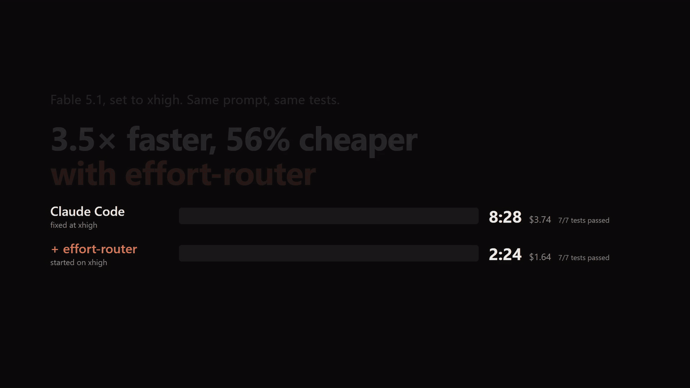
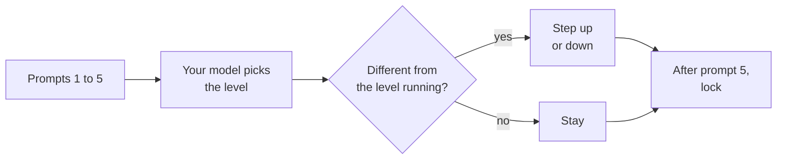
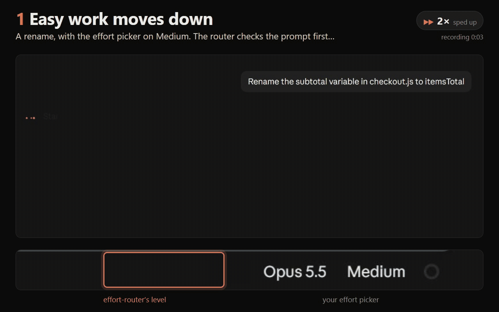
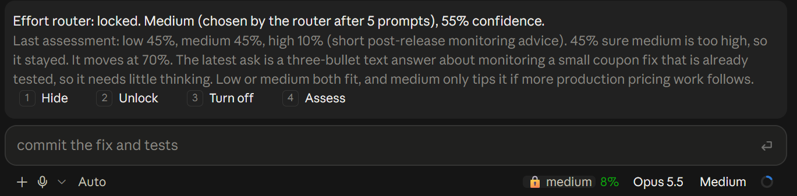
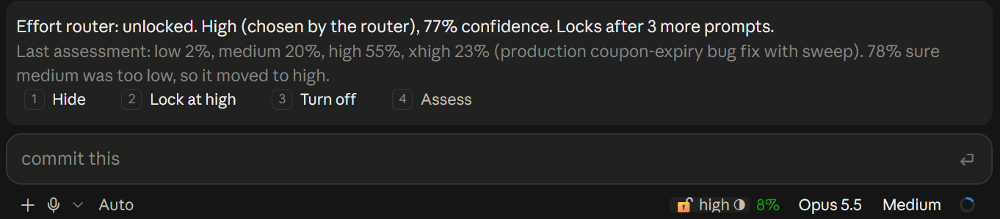

# effort-router

A Claude Code plugin that saves time and money by running each task at the lowest reasoning effort that does it well. Your
session's own model assesses each of your first five prompts and moves the level to whichever gets the work done fastest
and cheapest, up or down. Then the level locks for the rest of the session. Each subagent gets its own level, chosen by the agent that launches it.



It works with Fable 5.1, Opus 5.5 and Sonnet 5.5, in the terminal and in the Desktop app's Code tab. It requires
Claude Code 2.1.286 or later.

In the Desktop app, go to Customize, then Plugins, Add marketplace, Add from a repository, then enter
`tommy5dollar/effort-router`. Then in a Code tab session, click **+** next to the prompt box, then Plugins, Add plugin,
and install effort-router. In the terminal:

```
claude plugin marketplace add tommy5dollar/effort-router
claude plugin install effort-router@tommy5dollar
```

Then start a new session. In the Desktop app the footer appears once you've sent the first message.

## Contents

- **Start here:** [Why](#why) · [What it reads, sends and stores](#what-it-reads-sends-and-stores) · [Common questions](#common-questions) · [How it works](#how-it-works)
- **Using it:** [The footer](#the-footer) · [The band](#the-band) · [Commands](#commands) · [Messages in the conversation](#messages-in-the-conversation) · [Changing the level yourself](#changing-the-level-yourself)
- **How it decides:** [How it assesses](#how-it-assesses) · [Sessions that started before the router](#sessions-that-started-before-the-router) · [Subagents](#subagents) · [Models](#models) · [Where the effort went](#where-the-effort-went)
- **Setting it up:** [Options](#options) · [Customising the rules](#customising-the-rules) · [For organisations](#for-organisations) · [Telemetry for organisations](#telemetry-for-organisations) · [Turning it off and uninstalling](#turning-it-off-and-uninstalling)
- **Reference:** [Known limits](#known-limits) · [Development](#development)

## Why

Claude Code runs every request at the level you picked. Anthropic's
[Using Claude Code: Spending your effort](https://claude.dev/blog/spending-your-effort/) (Thariq Shihipar, 25
September 2026) found that effort buys verification and edge-case testing, not a better approach, so the right level
depends on the task. The router gives your session's model those principles and sourced notes on what each level can
do on that model, then lets it judge. It never maps a kind of task to a fixed level, because level names mean
different things on Opus, Sonnet and Fable.

**Does it save money and time?** That's what it's for. When two levels would both do the work, it picks the cheaper
one. The higher you run, the more it saves. In our test, Fable 5.1 on xhigh was given three small chores in a
payments repo to hand to subagents. The router moved it to medium and its Opus subagents to medium or low. It finished
in about 2 minutes for $1.10 to $1.65, against 6 to 8.5 minutes and $3.20 to $3.75 left on xhigh, and every
test passed both ways. Those figures include the router's own assessments. On Opus 5.5's default of medium there's
less to step down from, so it mostly picks off the small tasks. It still steps up when the work clearly needs it,
because a hard task done right first time costs less than the rework, in tokens and in your own time.
`/er report` shows what ran at each level, so you can see what it did to your own work.

**What routing costs.** Each of the first five prompts waits about 1.5 seconds for an assessment. The first is a
separate call that can't use the prompt cache: about 5 cents on Opus 5.5 or 13 cents on Fable 5.1. The other four read
your conversation from the session's cache, about 3 cents each on Opus. So a session costs about 20 cents to route on
Opus, then nothing more. A subagent's assessment is about 2 cents.

## What it reads, sends and stores

This plugin runs inside Claude Code without a sandbox, so here's exactly what it does:

- **Sends:** assessments go to your session's own model through Claude Code, on your existing login. If your
  organisation has set up Claude Code's OpenTelemetry, it adds a few attributes to Claude Code's own records for that
  collector (see [Telemetry](#telemetry-for-organisations)). Nothing else leaves your machine.
- **Reads:** your conversation, your CLAUDE.md files, rules and memory, your agent definitions and its own rules files
  (see [How it assesses](#how-it-assesses) for what goes into each assessment).
- **Writes:** one small JSON file per session in `~/.claude/effort-router/spend/`, and nothing else.
- **Never:** runs a process, changes your saved effort setting or changes the model.

## Common questions

- **Does it change my model?** No. It only changes effort, and stands aside on models it doesn't support.
- **Can I ask for more or less effort in my prompt?** Yes, while the level is unlocked: name a level ("use low effort")
  or say "think really hard about this" or "quick one", and the assessment follows it. Asking for max gets xhigh unless
  `highestLevel` is max. Once the level has locked, prompts aren't assessed, so use the band or `/er assess`. Without the router, words like that only nudge how much the model
  thinks within the level you set.
- **What if I disagree with it?** Change the effort picker and routing turns off for that session, with your level in
  force. Or press Lock, Unlock or Assess in the band.
- **What if an assessment fails or is slow?** The prompt runs at the level it already had. Nothing waits longer than
  30 seconds.
- **Does it work in VS Code or with `-p`?** It routes there too, but there's no footer or band. Use `/er` instead.
- **Can it keep assessing instead of locking?** Set `promptsToAssess` higher (say 50). Each extra assessment costs
  about 3 cents and 1.5 seconds on Opus 5.5.
- **Why does Claude Code still say "with medium effort"?** That line shows your setting, not the level the request
  was sent at. See [Known limits](#known-limits).

## How it works



1. **It starts from your effort setting.** Nothing changes until an assessment picks another level.
2. **Each of your first five prompts is assessed before its turn runs.** Your session's model is asked one question: which level gets this session's work done in the least time and total inference cost, counting the rework that too little effort causes? It's told that people use the router to spend less, so when two levels would both do the work it picks the cheaper one, and that your own words about effort ("think really hard about this", "quick one") are your call. It answers with a level and a reason, or says no task has been stated yet.
3. **The session goes to the level it picked.** Switching costs you nothing (no approval, no review), so the router doesn't second-guess the answer. If it picks the level already running, nothing changes.
4. **After the fifth assessment it locks** whatever level is running. A move never locks early.
5. **Only an assessment changes the level**, or a button whose label names the level.

Locking after a fixed number of prompts is deliberate. A fixed window always ends, still catches a task that grows over the first few prompts, and has one number to tune (`promptsToAssess`).

Before 0.18 the model gave every level a probability and the router moved only when 70% of it sat on one side of the level running. That made the outcome depend on where you started: a spec'd feature that read as medium went to medium from xhigh but stayed on high from high. Asking the model for the level and doing what it says gives the same answer from any setting.

## The footer

The footer sits beside the native model and effort pickers. It shows the router's status, the level running and, while unlocked, how much of the window is used.



| Footer | What it means |
| --- | --- |
| `🔓 MEDIUM ○` | Unlocked, nothing assessed yet. Your setting (medium) runs |
| `🔓 HIGH ◔` | Unlocked with one prompt assessed, which moved the level to high |
| `🔓 HIGH ◑` | Two or three assessed |
| `🔓 HIGH ◕` | Four assessed. The next prompt is the last one assessed |
| `🔓 …` | An assessment is running (the turn starts when it's done), or a new session hasn't shown your level yet |
| `🔒 HIGH` | Locked. Every request on the main thread runs at high |
| `⏸️ MEDIUM` | Off. Your own effort setting applies |

The circle never fills. When the window ends the padlock closes instead. The level is in capitals, to tell it apart from the picker's own label, which shows your setting.

Levels have no colours, because a scale from green to red would suggest that low effort is good.

## The band

Clicking the footer opens the band above the prompt. `/er` does the same. It never opens by itself.

```
Effort router: unlocked. High (chosen by the router). Locks after 1 more prompt.
Last assessment: high (bug fix touching three services), so it moved from medium.
Subagents get their own level: 4 routed this session.
1 Hide   2 Lock at high   3 Turn off   4 Assess
```

The first line is the footer in words: the status, the level and where it came from, and what happens next. The second is the last assessment. The third appears once a subagent has been routed.

The four buttons always sit in the same slots, so the digit keys are learnable. They run from doing nothing to taking action:

| Slot | Unlocked | Locked | Off |
| --- | --- | --- | --- |
| 1 | Hide | Hide | Hide |
| 2 | Lock at high | Unlock | Turn on, locked at high |
| 3 | Turn off | Turn off | Turn on, unlocked |
| 4 | Assess (greyed out) | Assess | Turn on and assess |



- **Lock** ends assessing early when the level is plainly right.
- **Unlock** keeps the locked level running and assesses your next five prompts from there. Use it when you're about to steer the work somewhere new.
- **Assess** while locked runs one fresh assessment now. If it moves the level, the new level stays locked. This is the "the work changed, look again" case the article recommends. While unlocked it's greyed out, because your next prompt is assessed anyway and a re-roll invites fishing for an answer.
- **Turn off** stops routing for this session. Your effort setting applies and subagents aren't routed.
- **Turn on, locked at high** brings back the router's last level in one press. It's greyed out when the router never had a level of its own.
- **Turn on, unlocked** starts a fresh window from your own setting.

A greyed-out button stays in its slot. Pressing it says why it's greyed out. In the Desktop app, Hide is drawn as the panel's own close control.



## Commands

`/effort-router` sits beside `/effort` in the typeahead, and `/er` is its short form. Each verb does what the band's matching button does, so the commands are also the controls where there's no band (VS Code and `-p`).

| Command | Band | What it does |
| --- | --- | --- |
| `/er` | Clicking the footer | Opens the band. Where there's no band it prints the band's lines |
| `/er lock` | Slot 2 | Locks at the level running. When off, turns on locked at the router's last level |
| `/er unlock` | Slot 2 | Unlocks. When off, turns on unlocked |
| `/er off`, `/er on` | Slot 3 | Turns routing off, or on and unlocked |
| `/er assess [hint]` | Slot 4 | Assesses now. While unlocked it keeps the hint for your next prompt's assessment instead (`/er assess this is a security review`) |
| `/er report [session\|week\|month\|all]` | | Where the effort went |
| `/er status` | | The band's lines, then the details for troubleshooting: the last reply in full and what it was judged against, assessments used, the last error and the routed subagents |
| `/er rules` | | The rules in force, where each layer came from, and the notes for your model |

The verbs are explicit rather than toggles, so repeating one is safe ("Already locked at high"). Anything else is refused with the list above, so a typo never runs an assessment.

## Messages in the conversation

Each change adds one dim line to the conversation, labelled `effort-router` by Claude Code. These lines are for you and are never sent to the model. An assessment that stays put adds nothing.

| What changed | Message |
| --- | --- |
| An assessment moved the level | Assessed, medium to high (bug fix touching three services). |
| It locked after the last prompt | Locked at high. |
| You pressed Lock | You locked it at high. |
| You pressed Unlock | Unlocked. Assessing again from your next prompt. |
| You changed the effort picker | You changed the effort to xhigh, so routing is off. |
| You turned it off | Off. Your effort (medium) applies. |
| You turned it on | On, locked at high. Or: On, unlocked. |

## Changing the level yourself

Changing the effort picker turns routing off, whether it was locked or unlocked, and your new level applies from that request on. The router never sets your effort setting itself: it sets the level on each request instead. So the picker keeps showing your own level while the footer shows the one in use.

In the Desktop app the picker keeps showing your setting while the router runs another level. Picking the level it already shows changes nothing there, so use Turn off instead.

## How it assesses

- **Before your prompt runs.** Each of the first five prompts waits for one assessment, so the turn's first request already carries the level. If the assessment takes longer than 30 seconds or fails, the turn runs at the level it had, and `/er status` says why. A failed assessment still uses up its prompt, so the window ends when the footer says it will.
- **On your session's own model.** The model you chose to work in judges the task, because it judges better than a small model and the savings from getting the level right scale with it. When the conversation has a request to fork, an assessment is a fork of it: the session's own request (system prompt, tools, CLAUDE.md, memory and the whole conversation) with one question added, served from the prompt cache. Measured on Opus 5.5 with a 72k-token conversation: 1.6 seconds, about 2.8k fresh input tokens and 40 output tokens.
- **The first prompt is a separate call.** Before the session has sent anything there is no request to fork, and a mod can't build one with Claude Code's system prompt and tools. So the first assessment is one call to the same model with your CLAUDE.md files, rules and memory (up to 80,000 characters, about 20k tokens) and your prompt. The same happens after `/clear`, or after a resume that starts afresh.
- **What a separate call reads.** Your prompts and answers in full, Claude's replies shortened and tool calls as names only, up to 24,000 characters. Tool results, file contents and thinking never go in. Over the cap it keeps your first prompt (the original task), then the newest lines. The prompt being assessed always goes in whole, outside the cap, because a long dictated brief is the prompt that matters most.
- **Told the level running.** That's the router's own level after a move, or your effort setting. The router learns your setting from the first request (nothing else shows it), so the first assessment's level is applied when that request arrives.
- **Up to xhigh.** Assessments are offered levels up to `highestLevel` (xhigh by default): on all three models max rarely beats xhigh and can overthink. If your own setting is higher (max, say), they're offered levels up to yours, so a session you set to max can stay there.
- **Your answers count too.** Answers to Claude's multiple-choice questions on the main thread are a human turn as well. They're assessed before they go back to Claude, by a fork that carries them. They count toward the window like a prompt.
- **No clear task yet.** The model answers that only for opening filler: greetings, housekeeping such as "pull the latest code", or questions asked before any work. Once you've stated a real task it picks the level that task most likely needs, even while the details are open. The assessment still uses up its prompt.
- **The latest exchange counts most.** A later clarification overrides an earlier ask, and a short reply is read against the question it answers.
- **A prompt sent while a turn is running** isn't assessed. The next one is.
- **Every assessment is kept.** Each one's level, reason, the level the session was on and what it did go into the session's ledger, for calibrating the model notes.

## Sessions that started before the router

The first time the router sees a session, it counts the prompts already in it. Those count toward the window. A session that already has five or more prompts starts off and the band says "This session started before the router". Its subagents are still routed, because each brief is a fresh, whole task.

The router keeps each session's status in that session's ledger, so `claude --resume` picks up where it was.

## Subagents

Claude can't set a subagent's effort itself: the Agent tool takes a model but no effort. Without the router every subagent runs at the session's level unless its agent definition sets one.

- **Its parent decides.** When Claude launches a subagent, the launch waits for one fork of the parent's conversation, asked which level the subagent needs, with its brief. The parent knows the task and why it's delegating this part, which a brief alone often doesn't say. Then the subagent starts, and every request it makes carries that level. Measured on Opus 5.5: 2.3 to 3.3 seconds, the parent's conversation read from cache, about 2 cents. Before the parent's first reply there's nothing to fork, so it's a separate call that reads the brief alone.
- **On its own model.** The assessment is told which model the subagent runs on (the Agent call's model, else its definition's, else the parent's) and gets that model's notes. Your rules and your organisation's apply here too.
- **Haiku agents are left alone.** A subagent on Haiku (the built-in Explore agent runs there) or on another model the router doesn't support isn't assessed.
- **An agent's own `effort:` wins.** If the agent's definition sets an effort, the router leaves its requests alone and the engine applies that level. The router finds the definition by its `name:` in the project's `.claude/agents/*.md`, then your `~/.claude/agents/*.md`, and in the `agents` key of policy, project and user settings. The first definition with that name decides, as it does for the engine.
- **Forks and failures take the parent's level.** A fork shares its parent's context, so it isn't assessed. If an assessment fails, times out or gives no level, the subagent takes its parent's level too.
- **Turning the router off** sends subagents back to your effort setting. Turning it on brings their routed levels back.
- **Seeing it.** The band counts the subagents routed this session. `/er status` lists the last ten, newest first, with each one's level and why. Every routed subagent is also kept in the session's ledger, with the level it would have inherited from its parent, the level it got and why.

Set `routeSubagents` to `false` to leave subagents at the session's level.

## Models

The router supports Fable 5.1, Opus 5.5 and Sonnet 5.5. Level names don't mean the same amount of thinking on each, and each responds to effort differently. In Claude Code, Opus 5.5 and Sonnet 5.5 default to medium and Fable 5.1 to high. Opus 5.5 gains most from low to medium and little above high, while Sonnet 5.5 gains a lot at every step. Routing one like another would be a mistake.

Each has a notes file in [`rules/models/`](rules/models/) on how its levels behave, in the same shape for every model: how effort pays on it, Anthropic's advice for it, then each level with its cost and time against medium and how it behaves. They are heuristics. Benchmark scores are left out, because a few points on a hard benchmark means a few more of the hardest tasks solved, not every task done better. Every assessment carries the notes for the model it's about, after the routing rules. Lines about max are left out unless max is on offer. `/er rules` prints them. The evidence behind each line, with sources, is in [`rules/models/research-2026-10.md`](rules/models/research-2026-10.md) and its [addendum](rules/models/research-2026-10-addendum.md). No eval results are in the notes, ours or anyone's. The router's routing eval ([eval/routing.ts](eval/routing.ts)) checks 87 prompts against an approved level for each, and any change to the prompt, rules or notes has to pass it.

The notes guide the level instead of fixed rules because of an eval on 4 October 2026. With rules that tied kinds of task to levels, all three models gave almost the same answers and ignored their notes. Without those rules, each model's answers moved the way its evidence predicts (`TESTING.md`, "Prompt variants").

On any other model the router stands aside: the footer shows `⏸️` with your level, the band names the models it works with, and nothing is assessed. Its state is kept, so switching back with `/model` picks up where it was. A new model needs a new version of the router.

## Where the effort went

`/er report` shows what your requests spent at each level over the last 7 days. `/er report session`, `month` or `all` cover other spans. For example:

```
Effort for the last 7 days (since 2026-09-28): 412 requests in 9 sessions, 610k output tokens.
By level:
- low: 120 requests, 31k output tokens (avg 258)
- medium: 260 requests, 410k output tokens (avg 1.6k)
- high: 32 requests, 169k output tokens (avg 5.3k)
Changed by the router: 74 requests
- subagents, medium → low: 44 requests, 9.9k output tokens (avg 225, vs 1.6k for those left at medium)
- main conversation, medium → high: 30 requests, 160k output tokens (avg 5.3k, vs 1.6k for those left at medium)
The router's own assessments: 61 (9 of a first prompt, 14 of a conversation, 38 for subagents), using 3.1k output and 1.20M input tokens.
By repo (output tokens): payments 400k, web 210k.
No "saved" figure: the router lowers easy tasks and raises hard ones, so these averages can't show what a changed request would have cost.
```

- **What it records.** Every model request in every session with the router installed, on the main thread and in subagents, with the router on or off. For each it keeps the level the request arrived at, the level it went out at, and its tokens as the API reported them. Requests are summed per day into one small JSON file per session in `~/.claude/effort-router/spend/`, which also holds the session's status and its assessments. Nothing leaves your machine.
- **Why output tokens.** Output (thinking plus the answer) is what effort changes most. Input is recorded too.
- **Why there's no "saved" figure.** A lowered request is small partly because its task was small, so comparing it with the average medium request would overstate the saving. Only running the same task at both levels could say what a request would have cost at its old level. The report gives the measured numbers side by side and leaves that estimate out.

## Options

Set them in `/plugin configure`, or under `pluginConfigs["effort-router@tommy5dollar"].options` in settings.json. Every option has a default, so there's nothing to set up.

| Option | Default | Meaning |
| --- | --- | --- |
| `promptsToAssess` | 5 | How many of a session's first prompts are assessed before the level locks |
| `highestLevel` | `xhigh` | The highest level the router picks, unless your own setting is higher. `max` allows max |
| `routeSubagents` | true | Give each subagent its own level. `false`: subagents run at the session's level |
| `rules` | empty | Your routing rules in plain words (see below). A rules file takes precedence |

Options from earlier versions (`consent`, `decideWithin`, `showChecks` and the rest) are ignored.

## Customising the rules

The shipped rules ([`rules/default.md`](rules/default.md)) are principles, not a table of levels:

- Effort buys verification, edge-case testing and independent judgement, not a better approach.
- Weigh how much is hidden (what a careful engineer could miss: edge cases, existing code, concurrency, security), whether you're in the loop, how well specified the task is, and how big it is.

You can add to them or replace them. Rules are plain markdown, layered from the bottom up:

1. The shipped defaults
2. Your organisation's rules, from managed settings
3. Yours: `~/.claude/effort-router.md`, or the `rules` option in your user settings
4. The project's: `<project root>/.claude/effort-router.md` (commit it), or the `rules` option in project settings

A line that is exactly `$defaults` pulls in everything beneath that layer. Text after it adds to the rules, and later rules win. A file with no `$defaults` line replaces everything beneath it. A starter file:

```markdown
$defaults

- This is a payments codebase. Never pick below high: money movement needs verification.
```

The files are re-read on every assessment, so edits apply without a reload. Missing, empty or unreadable files change nothing, and HTML comments are ignored. The frame around the rules (the levels on offer, what to optimise, when to answer "no clear task" and the JSON reply) is fixed, so no rules file can break the parser.

## For organisations

An organisation can add routing rules for everyone in managed settings (`managed-settings.json`), as it does for other Claude Code policy:

```json
{
  "pluginConfigs": {
    "effort-router@tommy5dollar": {
      "options": {
        "rules": "$defaults\n\n- Code under payments/ or ledger/ is never routed below high.\n- Infrastructure changes (terraform/, k8s/) are high."
      }
    }
  }
}
```

The organisation's rules layer over the shipped defaults, and each person's and project's rules layer over those. They're there to help people pick well, not to stop anyone changing their effort, so a person can still turn the router off or replace the rules with their own. A top-level `"effortRouter": { "rules": "..." }` object works too.

## Telemetry for organisations

If your organisation collects Claude Code's OpenTelemetry (`CLAUDE_CODE_ENABLE_TELEMETRY=1` with an OTLP exporter),
each `claude_code.api_request` record already carries `effort`: the level that request actually went out at, after
the router. The router adds these attributes to the same record, so a collector can see what it changed:

| Attribute | Value |
| --- | --- |
| `effort_router.setting` | The person's own effort setting, the level the request would have run at. Left out until a request has shown it |
| `effort_router.status` | `unlocked`, `locked`, `off` or `standing aside` (a model the router doesn't support) |
| `effort_router.level` | The level the router applies on the main thread, when it has one |
| `effort_router.off_reason` | When off: `you` (turned off), `picker` (changed the effort picker) or `mid-flow` (the session started before the router) |
| `effort_router.version` | The router's version |

Claude Code's own `query_source` attribute says whose request it was. In testing under `-p` the main thread was `sdk`
and a general-purpose subagent was `agent:builtin:general-purpose`. Check the values your own sessions send.

- **What moved:** `effort` differs from `effort_router.setting`. On the main thread that's the router. On a subagent
  it's the router or the agent definition's own `effort:`.
- **The values are the session's, not the request's.** The engine gives a mod no way to tie a record to one request,
  so a subagent's record carries its session's status and setting.
- **Nothing is sent anywhere new.** The attributes ride on records Claude Code was already sending to your collector.
  Without telemetry configured there are no records and nothing is added. Other records are left alone.

## Turning it off and uninstalling

- **For one session:** `/er off`, or Turn off in the band. Changing the effort picker does the same.
- **Everywhere, keeping it installed:** `claude plugin disable effort-router@tommy5dollar`.
- **Removing it:** `claude plugin uninstall effort-router@tommy5dollar`. Then delete `~/.claude/effort-router/` to
  remove its ledgers, and `~/.claude/effort-router.md` if you wrote your own rules there.

## Known limits

- **Claude Code's own "with medium effort" line shows your setting, not the routed level.** It's built from the
  effort setting, not from the request. The request still goes out at the routed level: Claude Code's own telemetry
  records it there (see [Telemetry](#telemetry-for-organisations)). Trust the footer.
- **The Desktop app's effort picker never changes.** The app owns it and nothing a mod can call sets it. Requests still go out at the routed level, so trust the footer.
- **The router doesn't run `/effort`**, because in the terminal that also saves the level as your default for new sessions.
- **The first assessment can't share the prompt cache.** The engine offers no way to fork before the first response, and a separate call can't carry Claude Code's system prompt or tools. It pays for your instructions and the prompt once per session.
- **A fork thinks at the session's effort.** The router can't change that. On Fable 5.1 at xhigh a fork took 7 and 15 seconds in testing, against about 2 on Opus 5.5 at medium, so a prompt can wait that long. Past 30 seconds the prompt runs at the level it had and the tokens are still spent.
- **On Bedrock, Google Cloud or an LLM gateway** Claude Code clears the cached conversation when effort changes (Anthropic's docs). Expect one uncached request after each move there. With an API key or a subscription the cache is kept.
- **Once locked, the router doesn't notice a change of phase on its own** (for example "now verify it" after an implementation). Press Assess, or Unlock before steering somewhere new.
- **A picker level that's a number** rather than a named level can't be compared, so a first assessment waits for a request that shows a named level.
- **Effort only.** The router never changes the model.
- **Plugin agents (`<plugin>:<name>`) are routed from their brief**, because their definitions can't be located reliably. That replaces any effort their definition sets. An agent file added mid-session is seen from the next session.
- **Workflow agents that don't launch through the Agent tool** keep the main thread's level.
- **Subagent levels are kept in memory.** After a restart, a subagent still running from before takes the main thread's level.
- **The model isn't told its level.** Adding a note to the system prompt would break the prompt cache.
- **The spend report starts at 0.9.0**, so sessions from before it aren't in it. A request with no reported usage isn't counted. Days are UTC.
- **In the Desktop app a new session loads plugins with its first message.** Until you send something there is no footer and `/er` isn't available. That first message is assessed like any other.
- **The footer and band draw in the terminal and the Desktop app.** VS Code and `-p` run the router without them, and `/er` is the control there.

## Development

```
bun test                            # pure policy: the rule, footer and band text, /er grammar, trimming, parsing, rule layers, subagent reads, the ledger and report
claude plugin test .                # engine kit: assessments, the footer and band, /er, the picker, first sightings, saved state, agent.spawn, the ledger
claude plugin validate . --strict
bun run eval                        # opt-in: the real model over eval/fixtures.ts (see below)
```

`bun run eval` sends each fixture to the real model through `claude -p --safe-mode` (no plugins, hooks or tools), with the system prompt and input the router builds from `rules/default.md`. It covers the first assessment on the session's model (`--model`, default opus) with that model's notes, and a subagent's assessment from its brief. It can't reproduce forks. It parses each reply with the router's own parser and prints each verdict, the pass rate and every miss. `--runs 3` repeats each fixture (the model isn't deterministic), `--setting` sets the level the check is told the session is on, `--set session` or `--set subagent` one set and `--only <text>` filters fixtures by name. It uses your Claude Code login, and each fixture costs one small model call.

[TESTING.md](TESTING.md) lists what has been verified live. [CHANGELOG.md](../CHANGELOG.md) lists the versions.

## Licence

MIT
